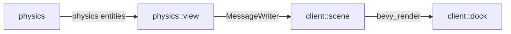

# Contributing guidelines

## LLM policy

### Usage

LLM usage must not exceed the purposes described in [llm-disclosure](llm-disclosure.md).
If you are contributing code and use it for a purpose not described in the file,
you must update the file to include the new usage in the same pull request.

All content submitted to this repository,
including code, comments, design and user documents, issues and comments,
must be reviewed by the submitter word-by-word before submission.
The author is responsible for ensuring that the submitted content represents their intent.

In principle, any content that can be trivially reproduced by entering a prompt to an LLM
is considered "slop" and may be directly rejected.

### AI Code review

Copilot code review is enabled for this repository as a supplementary check in addition to clippy lint.
You may resolve its review comments directly under the same principles you would ignore clippy warnings.
AI review may be pedantic or inaccurate, the same way clippy pedantic lints may be;
it is an auxiliary tool to improve project quality like linters.

AI code review is for reference only and is not a substitute for human review.
Whether AI code review is happy with a pull request has no direct impact on the decision to merge or reject it.

### Agent files

You may create or update files for AI agents (such as AGENTS.md, .agents/skills, etc)
if you find them useful for development workflow consistent with this policy.

Vendor-specific agent files (such as CLAUDE.md) are not allowed.
Any such files must be supported by at least two mainstream tools to be considered vendor-agnostic.

If your agent does not support a certain convention used in this project,
you may symlink it locally and add it to your `.git/info/exclude`.

## Feature request

Traffloat is a sophisticated game with many interacting components.
Any change may affect game balance in unexpected ways.

To propose a new feature, create a pull request updating the corresponding documents in [`docs/design`](docs/design/)
to comprehensively describe all possible interactions that the feature may have with other systems.

## Finding something to work on

To get started with this project, try working on one of the issues labeled with
[`scope: S`](https://github.com/traffloat/traffloat/issues?q=is%3Aissue%20state%3Aopen%20label%3A%22scope%3A%20S%22),
which involve fewer components and are easier to get into without prior familiarity with the codebase.

Issues labeled with `k: *` require specific domain knowledge not acquired by the average developer.

## Code style

- Before committing, run the following checks:

```sh
cargo +nightly fmt -- --check
cargo clippy --all --tests -- \
  -D clippy::dbg_macro \
  -D unused_imports \
  -D dead_code \
  -D unused_variables
cargo test --all
```

- Use the structure of `foo.rs`, `foo/submodule.rs`, etc. Do not use `foo/mod.rs`.
- Do not import `bevy::prelude::*`,
  nor to import the re-exports from `bevy::prelude` if a direct import is possible.
- Unit tests should be under a separate tests.rs file
  and included from the parent with `#[cfg(test)] mod tests;`.
- Use `distance_cmp` and `magnitude_cmp` for comparing vector norms.
  Do not use the exact or squared methods for comparisons alone.
- Use `Vec::from([...])` or `[...].into()` instead of `vec![...]` for Vec literals.
  Large expressions in macros tend to be unfriendly to rust-analyzer.
  - For consistency, use `Vec::new()` instead of `vec![]` for empty Vecs.
- Use the `TryLog` extension trait for getting components from `World` or `Query`
  if absence of the component would be a bug.
  Similarly, use `try_log`/`try_log_return` where suitable.
  The `None` branch should result in termination of processing of the current entity,
  unless the system involves aggregation over all queried entities,
  in which case the aggregation result must not be used
  to avoid propagating errors.

### Plugin structure

The typical plugin module should be structured in the following order:

- Plugin struct (conventionally named `Plug`) and `impl Plugin for Plug`.
- System sets
- Resources
- Components
- Commands (e.g. `SpawnCommand`, `DespawnCommand`)
- Private systems

All components and resources should derive `Reflect` and register through `App::register_type`.

## Project structure

- `proto`: Shared types from `physics` to `client`.
- `physics`: Core simulation engine.
- `client`: Frontend client for visualizing and interacting with the world.
  Does not share any entities with the core simulation directly;
  all gameplay interactions are done through `proto`.
  - `client::scene` syncs updates received from `physics` and creates separate client entities with render components
  - `client::dock` manages client UI through `egui_dock`, with a `Camera` tab to display scene entities.
- `server` (unimplemented): Server exposing `physics`

Singleplayer communication channels:


